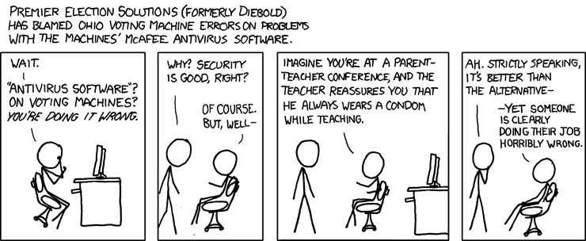

Let’s look at some general problems of humanity as we evolved. About 70,000 years ago, homo sapiens were blessed with cognitive awakening. We started to become the dominant species and causing a material impact on this world. Though our problem was just survival and we were hunter-gatherers. Then about 10,000 years ago, the agricultural revolution did put us on a path of hyper-growth. We "invented" some cool stuff along such as social disorders, war, and poverty. Eventually, it was the scientific revolution that led us to the advent of the Internet. If questions of evolution and our future intrigue you then grab a copy of the book titled "Sapiens: A Brief History of Humankind" by Yuval Noah Harari.

## Human Attack Surface
Capitalism and consumerism have given birth to many of the challenges we face today. Arguably, one of the fastest-growing issues is  Cybersecurity. In this article, I’ll try to deconstruct the accountability and ownership issues related to Cybersecurity. We'll touch upon some key questions such as — Who’re the responsible stakeholders? What responsibilities they own? and, What can we do better? I'm not going to delve too much into the concepts of Cybersecurity itself. The following info-graphic gives us a glimpse of how much vulnerable we are.

  
  <figcaption>'Human' Attack Surface</figcaption>

## What am I supposed to do for Cybersecurity?

In the last decade, digital adoption by companies, organizations and governments has put Cybersecurity at the forefront. It would be hard to find someone who hasn’t heard of Cybersecurity related news. In that context, untangling Cybersecurity accountability becomes a complicated job. But let’s simplify it for our understanding sake. We’ll focus on cybersecurity as it relates to business and its stakeholders – owners, employees, consumers, citizen, Government and society as a whole. The Government has a much larger role to play but deserves a dedicated conversation of its own. We'll reserve that discussion for another post.  

  
  <figcaption>Cybersecurity Stakeholders</figcaption>

## Board, Director and Top Management's Role in Cybersecurity 

Simply put, the board or board of directors have the responsibility of governing the organization. They provide strategic direction and purpose. Board works to preserve the interest of shareholders. For most boards, Cybersecurity is the elephant in the room. And even for the ones who acknowledge it, Cybersecurity is daunting and at times overwhelming. Unsurprisingly, there are still a lot who’d think this isn’t their problem. What they're not realizing is that it is not a question of if, but when. Although, things have improved a lot in the past decade. Many organizations now include Cybersecurity, in some form, as a strategic goal. But mostly the execution is plagued with wrong steps. Either it is an IT problem, or the board is left at mercy of IT to "educate" and "guide" them on Cybersecurity preparedness. It doesn’t have to be this way though. 

__Cybersecurity is a governance problem. End of the day it is a business risk and should be managed so – call it Cyber Risk.__

*So what does board (or higher management) need to do?*

If one wants to do things in an ideal manner, there are endless approaches and proven frameworks such as NIST, ISO, and SABSA. But it all begins with acknowledging the place for Cybersecurity. Barring exceptions, it is never advised to let IT or Cybersecurity teams be the strategic decision-maker. They shouldn't be acting on behalf of the board about cybersecurity whether by choice or by "design". 

  
  <figcaption>Business Aligned Cybersecurity Objectives</figcaption>

When thinking about Cybersecurity, always start with your business objectives and goals. Conscientiously, factor for your assets, risks, processes, and compliance. People mostly think of Cybersecurity as a "protection" means, but it could be a massive business enabler. Getting GDPR compliance would likely support business expansions in new geographies. Or a cutting edge, biometric authentication could just be the right assurance needed by prospective customers of your wealth management platform. The board should be setting the direction for its technology teams. Your cybersecurity spending should trace back to your business objectives, else, you're doing something wrong.

It is also worth realizing that cyber defence or cyber protection alone is only one side of the coin. What the board and management need to be additionally prepared for is cyber resilience!! How do we survive when a cyber crisis hits us? Some questions to be pondered upon, 

* Can we deal with cyber-attacks all by ourselves?
* Can we continue to operate when there’s a cyber-attack on our supply chain? 
* How do we keep core business functioning? 
* What about Cyber insurance? 
* What and how much we tell the Media? 

## IT, Info-sec and Operations Team's Role in Cybersecurity 

IT, typically, is where cybersecurity gets “executed”. Normally, the CISO (or an equal function) is the owner of the Information Security Organization. It dictates policies, frameworks and general direction. While the “operational” side of Cybersecurity technologies likely would sit under IT operations. 

The problem in Cybersecurity implementation arises because, sooner or later, the objectives and effectiveness start getting siloed. They tend to lose the holistic view of the cybersecurity needs of the organization. Common reasons are getting influenced by technology vendors, favouritism with a particular technology or tool, over-optimization, under-optimization, compliance ticks, or just doing things because everyone else is doing it. The list is non-ending. 

*So, what does IT need to do?*

First non-negotiable step, everything should trace back to business objectives. Take a risk-based and holistic approach. For instance, a cutting edge security monitoring tool is probably not a good idea when the basic patch management hygiene is missing. Or your asset inventory management is out of whack and unaccounted servers running windows 95 are exposed to the world. The security adage – security is only as strong as weakest - isn’t meaningless. 
* Know your assets, goals, and priorities. 
* Measure overarching maturity of cybersecurity. If not sure how to approach it, use frameworks such as NIST CSF along with CMMi.
* Understand risk exposure by mapping cybersecurity maturity with your assets/goals/priority. For example, if credit card data is a key asset for your organization and your data protection maturity is very low = HIGH RISK. 
* Bring objective methods such as above whilst deciding spending. Don’t let the loud voices and buried bias within that influence the budget. 
* Be realistic. No matter how much you spend on “awareness”, we won’t lose our “human error” skill. Someone is going to click on that malware-laden email. Be prepared to deal with it. I'll probably do a dedicated post on it sometime soon.
 

## Other Employee's Role in Cybersecurity 

We share passwords. At times stick it on the monitor. We also act on every email from the "Nigerian Prince" who wants to deposit a large sum of money in our bank accounts. You might be thinking that everyone has now become better than this. But the fact is that bad guys are usually a few steps ahead and the "Nigerian Prince" scam still rakes in over million dollars annually. You may not be clicking on that spam email but you may be delaying that critical operating system patch. That could just prove to be the very thing that brings down your entire organization with ransomware infestation.  

  
  <figcaption>Dave, The Employee</figcaption>

Honestly, Dave hasn’t done a lot wrong. He was just being “human”. For long, cybersecurity investments have been done portraying Dave as his self-enemy. And the failure of those investments is also Dave’s fault. All these approaches are a little misguided, I think. Employees are catching up with changing dynamics of cybersecurity risks, so long as there are acknowledgement and awareness attempts from the board and top management. 

If you align with your organization’s goals then understand the impact of cybersecurity and how it negatively influences those goals.  Whilst the board and top management have the accountability to define expectations out of various organizational roles, it would be the individual’s onus to understand those and act accordingly.

## Consumer, Citizen 

This is us, well most of us, and we're at the receiving end. Many of us don't even think what's at stake or what's the impact and simple reason is immediacy – there's no immediate feel. The hacking and ransomware news sounds like science fiction. And general reaction, if any, is no different than how we react to news of killings happening in a country which is 1000 miles away. But the Internet has no boundaries.  [The instances of hackers targeting individuals are few but results are stressful](https://www.wired.com/2012/08/apple-amazon-mat-honan-hacking/). 

This is a big topic. You are directly impacted when your credit card details are stolen but you're equally, or more, affected when you private data is stolen. Many of us still don't care about it but the data has lot of value for companies and bad guys who're targeting you as their "customer". As an example, hackers targeting someone who's crazy about bowling with a phishing email as invitation to participate in upcoming exclusive competition. Fortunately, companies, governments and regulatory bodies have been continuously evolving. And there are few simple measures which can elevate your cybersecurity preparedness quotient. 

  
  <figcaption>Staying Safe on Internet</figcaption>

* Don't sweat too  much about changing passowrds frequently if your quality of passwords is high. Have long but memorable passwords, use phrases if that helps. 
* ALWAYS Use multi-factor authentications such as SMS one-time passwords or, better, phone based authenticators such as Authy, Google Authenticator, Microsoft Authenticator etc. where the service allows. Specially protect your emails as they're gateway to lot of details about yourself. 
* Use password managers to remember passwords for you. Many reputed password managers offer free service such as Bitwarden, lastpass etc. You can also use web browser's in-built password manager e.g. Chrome, Firefox etc. 
* Use reputed email service such as gmail or outlook which has a much better spam filtering as compared to let's say yahoo. 
* Keep software up-to-date – your laptops, phones, tablets etc.  
* Be vigilant about where you're clicking or what you're installing.
* Avoid clicking on email links, prefer searching for a business or item on Google or Bing directly.

Like everything, cybersecurity preparedness is also evolving. We learn as we go along. In that spirit, finishing with the joke below. 

  
  <figcaption></figcaption>

Image Attributions:
* *Hero Image:* [Business vector created by jcomp - www.freepik.com](https://www.freepik.com/vectors/business)
* *Human Attack Surface*: [Cisco/Cybersecurity Ventures 2019 Cybersecurity Almanac](https://cybersecurityventures.com/cybersecurity-almanac-2019/)
* *Staying Safe on Internet*: [Infographic vector created by freepik - www.freepik.com](https://www.freepik.com/vectors/infographic)
* *Voting Machines*: [xkcd.com](https://imgs.xkcd.com/comics/voting_machines.png)